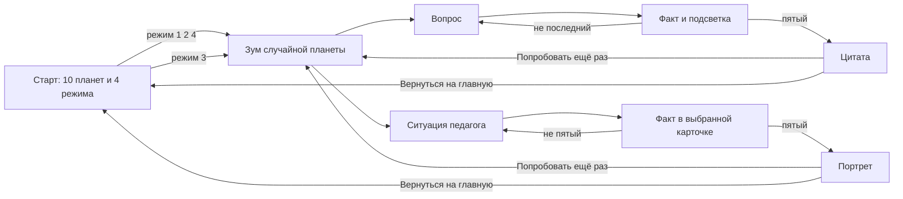

# Требования: киоск «Орбита»

Источник правды для сборки киоска. Не менять вопросы, ответы, факты, цитаты, сценарий экранов и визуальные решения без явного запроса.

**Стенд:** Развитие человека — образование, наука и технологии. Международный фестиваль молодёжи, Екатеринбург. Горизонтальный тачскрин.

**Референсы оформления:** папка `Референсы/` в корне проекта.

## Правила набора

Киоск — **меню из четырёх режимов**. Гость выбирает режим кнопкой внизу старта, не планету пальцем.

1. **Викторина о России** — **10 сетов × 5 вопросов**, вопросы не повторяются между сетами. В каждом сете **ровно 1 вопрос про космос или людей космоса**; остальные — география, природа, культура, наука, исследователи. Несколько вопросов про Урал и Екатеринбург. Сложность: не «кто такой Гагарин» и не олимпиада. У каждого сета 1 чуть проще, 3 средних, 1 с изюминкой. История без войн, границ, репрессий, катастроф. Космос без гибели экипажей и гонки вооружений. Не спорим, кто «открыл Антарктиду». Не пишем, что у России больше всех часовых поясов в мире.
2. **Мифы о неандертальцах** — **4 сета × 5**, все 20 фактов из статьи «20 фактов о неандертальцах» (22century.ru). Только **правда / миф**. Тон энциклопедии; спорные темы без картинок и без оценки.
3. **Какой вы педагог** — **4 сета × 5**, ситуации в классе, **верного ответа нет**. Финал — один из пяти портретов, не цитата и не счёт. Колода сетов своя, как у других режимов.
4. **Кибербезопасность** — **4 сета × 5**. Тон энциклопедии, без запугивания. Типы вопросов как у России, кроме тапа по карте России.

Типы под горизонтальный тач: **4 кнопки**, **правда/неправда**, **сопоставить 4 пары**, **расставить по времени**, **лишнее**, **кто это**; у России ещё **тап по карте**. У неандертальцев — только **правда/миф**. У педагога — только **4 кнопки**, без верного ответа.

Язык: **сразу RU/EN**, переключатель на старте, дальше держим выбранный.

### Тексты на экране

- Варианты ответа **без подсказок в скобках**.
- Блок после ответа — **короткий факт для человека у экрана**, а не комментарий для постановщика. Тон энциклопедии: что это, зачем это помнят. Нельзя отсылать к стенду, фестивалю, «ловушкам для взрослых», «намёкам на войны», сравнениям «мы раньше — они позже».
- Названия сетов России — «миссии». Космический вопрос не всегда последний. На экране гость видит **название режима**, не имя планеты и не имя миссии.

### Выбор сета на киоске

Авторизации нет, гостя система не знает. Для **каждого режима с сетами** — своя колода (память приложения / localStorage). Новая игра в режиме берёт случайный сет из ещё не показанных. Когда колода режима кончилась — сбрасывается и перемешивается заново.

**Планеты** — отдельная колода из 10: случайное тело не привязано к сету и не к режиму. Когда показаны все 10 — колода тел сбрасывается.

Цитаты на финале режимов 1, 2 и 4 — **отдельная колода из 10**, общая, без привязки к сету.

---

## Сценарий экранов

Автовозврата с таймером нет: вход в режим — только одна из четырёх кнопок.

### 1. Старт

Горизонтальный кадр: тёмный зернистый космос (референс «Небесный объект» и стеклянные сферы «cosmos»), **10 вымышленных небесных тел**. Северное сияние на старте **не** используем — оно для финала.

**Орбитальные эллипсы и спутник — только на этом экране.** На зуме они уходят вместе с остальными телами. На вопросах, портрете и цитате фона с орбитами нет. Кольца на самих планетах и дуги вокруг знака в шапке — не фон кадра.

Слоган про Россию слева внизу **не** показываем.

Кнопки внизу кадра, четыре равные зоны:

- Викторина о России / Quiz about Russia
- Мифы о неандертальцах / Myths about Neanderthals
- Какой вы педагог / What teacher are you
- Кибербезопасность / Cybersecurity

Переключатель **RU | EN** — слева сверху.

Гость **не выбирает** объект пальцем. Кнопка режима берёт случайную планету из колоды тел и случайный сет из колоды режима.

### 2. Переход в режим

Остальные девять тел гаснут и уходят. Выбранный объект выходит в центр и приближается (масштаб + лёгкий параллакс колец). **Имя планеты не показываем.** На этом месте — название режима и краткое описание (тема, 5 вопросов; у педагога — пять ситуаций, портрет, не оценка). Затем проявляется первый вопрос или первая ситуация.

«Попробовать ещё раз» делает **то же самое в том же режиме**: новая случайная планета и следующий сет колоды.

### 3. Вопрос

Пять экранов подряд. Крупные зоны нажатия. Типы как в сетах режима. В шапке — название режима.

После выбора:

- у квизов факт к **правильному** ответу всегда; выбранный вариант и верный **тихо подсвечиваются** (спокойное свечение у верного; если промахнулись — выбранный остаётся видимым, но тусклее);
- у педагога факта «правильного» нет: светится **выбранная** карточка, внутри неё факт к этому жесту; чужие не тускнеют как ошибка;
- слов «верно», «ошибка», «правильно» нет, зелёного/красного светофора нет;
- кнопка **Далее / Next**.

Счётчик «вопрос 2 из 5» можно показать как тонкую орбитальную шкалу у знака, без очков.

### 4. Финал — цитата, не оценка

Только режимы 1, 2 и 4. **Не показываем**, сколько из пяти угадано. Ни баллов, ни «вы астронавт», ни прогресса знаний.

Фон — северное сияние (референс «Северное сияние в небе — текстура фона»). Поверх: один случайный текст из колоды цитат, имя, коротко кто это (писатель / учёный / космонавт). Кнопки: **Попробовать ещё раз / Try again** и **Вернуться на главную / Back to home**.

### 5. Финал педагога — портрет, не цитата

После пятой ситуации. **Не показываем**, какой портрет сколько раз выбрали. Ни баллов, ни «вы астронавт», ни категорий аттестации.

Фон — то же северное сияние, что у цитаты. Поверх: имя портрета, два-три предложения, тихое созвездие из пяти звёзд (ярче та, что вышла). Кнопки: **Попробовать ещё раз / Try again** и **Вернуться на главную / Back to home**.

Победитель — портрет, который выбирали чаще. Ничья — последний выбор из тех, кто делит первое место. В каждом сете каждый портрет встречается ровно в **4** вариантах из 20.

---

## Десять небесных объектов

На старте все видны сразу. Планета для перехода выбирается **случайно**, не привязана к сету и не к режиму. Стиль: стекло, внутреннее свечение, тонкие кольца у тел, зерно — как в референсах «cosmos» и «Небесный объект». Фон старта — тёмный космос без сияния.

1. **Кедра** — холодная голубая сфера, одно тонкое кольцо
2. **Альта** — серебристый диск, тонкие штрихи, дуга как крыло
3. **Колыбель** — почти белая сфера, голубое свечение по краю, топографический узор, две перекрёстные орбиты и спутник
4. **Селена** — серая, кратеры, кольцо-дорожка
5. **Эфир** — глубокая голубая, сетка меридианов, разрыв в кольце (шлюз)
6. **Мира** — несколько состыкованных стеклянных объёмов
7. **Пар** — два малых тела на общей орбите
8. **Оборот** — одна сторона в свете, другая в тени
9. **Поляр** — бирюзово-голубая, сияние по лимбу
10. **Вуаль** — плотная облачная сфера

---

## Десять цитат

На экране — оригинал; для EN — аккуратный перевод, не подстрочник.

1. **Михаил Ломоносов**, учёный
  «Может собственных Платонов и быстрых разумом Невтонов российская земля рождать.»  
   *Ода 1747 года*
2. **Константин Циолковский**, учёный
  «Планета есть колыбель разума, но нельзя вечно жить в колыбели.»  
   *«Исследование мировых пространств реактивными приборами», 1911–1912*
3. **Юрий Гагарин**, космонавт
  «Облетев Землю в корабле-спутнике, я увидел, как прекрасна наша планета.»
4. **Дмитрий Менделеев**, учёный  
   «Стараясь познать бесконечное, наука сама конца не имеет.»  
   *предисловие к 8-му изданию «Основ химии», 1906*
5. **Александр Пушкин**, писатель  
   «Москва… как много в этом звуке / Для сердца русского слилось! / Как много в нём отозвалось!»  
   *«Евгений Онегин»*
6. **Николай Рерих**, художник  
   «Культура есть почитание Света. Культура есть любовь к человеку.»  
   *статья «Культура — почитание Света»*
7. **Иван Павлов**, учёный
  «Как ни совершенно крыло птицы, оно никогда не смогло бы поднять её ввысь, не опираясь на воздух. Факты — это воздух учёного.»  
   *«Письмо к молодёжи»*
8. **Владимир Вернадский**, учёный
  «Человек может и должен перестраивать своим трудом и мыслью область своей жизни. Перед ним открываются всё более широкие творческие возможности.»  
   *«Несколько слов о ноосфере»*
9. **Сергей Королёв**, конструктор  
   «Мы бы не двинулись вперёд, если бы не решались на смелые шаги в неизвестное.»
10. **Константин Паустовский**, писатель
  «Природа учит нас понимать прекрасное. Любовь к родной стране невозможна без любви к её природе.»

---

## Оформление

Референсы: папка `Референсы/` — на старте стеклянные сферы, орбиты и зернистый синий «Небесный объект»; северное сияние — **только фон финального экрана с цитатой**. Тонкий HUD по углам — L-скобка с прямым углом.

- Горизонтальный кадр, **резина под 16:9** (точный пиксельный размер экрана неизвестен). Минимум кнопок ~64 px по короткой стороне.
- Палитра: чернильный `#27205D`, небесный `#C8DBE8`, диджитальный фиолетовый `#5854A4`, циан для свечения на таче, белая тонкая линия. Космос темнее чернильного. Без лосося, охры, жёлтого и зелёных школы. Зерно поверх градиента.
- Знак Хорошколы (силуэт скважины) — сверху по центру, без слова «хорошкола». На вопросах тот же слот становится орбитальной шкалой «N из 5».
- Тихий паттерн на всех экранах: шесть крупных блоков с референса гайдбука на весь кадр; белые почти прозрачные, щели — космос.
- HUD по углам — L-скобка с углом 90°. Кнопки режимов внизу старта — стекло, как карточки ответов; «Далее» — лёгкий фасет. Карточки ответов остаются скруглённым стеклом.
- Вопрос — крупный текст по центру над карточками, прямо на фоне космоса. Лёгкий блюр медленно ходит по буквам туда-сюда. Ответы — почти прозрачные скруглённые плитки: заливки почти нет, по краям неравномерное циановое свечение, не обводка. Верный ответ подсвечивается целиком. Факт — внутри верной карточки.
- Шрифт: Factor A для заголовков и кнопок, Manrope для длинного текста. Без декоративной «научной» каши из цифр в углу, которая мешает читать.
- Без эмодзи, без зелёно-красной школьной оценки.

---

## Принятые решения

- После ответа: факт + тихая подсветка, без «верно/неверно».
- Сразу RU/EN.
- «Попробовать ещё раз» = тот же режим, новая планета и следующий сет.
- «Вернуться на главную» = меню режимов.
- Вёрстка резиновая под горизонтальный 16:9.
- Итогового счёта нет.
- Автосброса по таймеру нет.
- Орбиты фона — только на старте.

---

## Миссия 1. «Поехали!»

**1. Карта / 4 кнопки. География**
Граница Европы и Азии в районе Екатеринбурга проходит по…

- Кавказскому хребту
- **Уральским горам**
- реке Волге
- Среднерусской возвышенности

*Почему:* условную границу двух частей света здесь ведут по Уралу. У стелы «Европа — Азия» можно стоять одной ногой в Европе, другой — в Азии.

**2. 4 кнопки. История**
В каком году Пётр I основал Санкт-Петербург?

- 1147
- **1703**
- 1812
- 1917

*Почему:* город заложили в 1703 году на Заячьем острове, в устье Невы. 1147-й — год первого летописного упоминания Москвы.

**3. Кто это. Человек науки**
Помогал открыть университет в Москве, писал труды по русскому языку и создавал мозаики из цветного стекла. Кто это?

- Дмитрий Менделеев
- **Михаил Ломоносов**
- Николай Карамзин
- Иван Крузенштерн

*Почему:* Михаил Ломоносов — учёный-энциклопедист XVIII века. Московский университет открыли в 1755 году при его участии.

**4. 4 кнопки. Природа**
Какая река вытекает из Байкала?

- Селенга
- Лена
- **Ангара**
- Енисей

*Почему:* в Байкал впадают сотни рек, а вытекает одна — Ангара. Дальше она впадает в Енисей. Селенга, наоборот, несёт воду в озеро.

**5. 4 кнопки. Космос**
Какой позывной был у Юрия Гагарина в полёте 12 апреля 1961 года?

- Чайка
- Восток
- **Кедр**
- Алмаз

*Почему:* корабль назывался «Восток-1», позывной Гагарина — «Кедр». Он сделал один виток вокруг Земли. «Чайка» — позывной Валентины Терешковой.

---

## Миссия 2. «Чайка»

**1. 4 кнопки. География**
Куда впадает Волга — самая длинная река Европы?

- в Чёрное море
- в Балтийское море
- **в Каспийское море**
- в Белое море

*Почему:* Волга заканчивается в Каспии — крупнейшем замкнутом водоёме планеты. До Мирового океана её вода не доходит.

**2. Сопоставление. География городов**
Соедини город и устойчивое прозвище:

- Санкт-Петербург — **«северная Венеция»**
- Москва — **город на семи холмах**
- Екатеринбург — **город на границе Европы и Азии**
- Сочи — **«летняя столица» у тёплого моря**

*Почему:* у Петербурга — каналы и острова Невы, у Москвы — холмы, у Екатеринбурга — Уральский рубеж двух частей света, у Сочи — черноморское побережье.

**3. 4 кнопки. Культура**
Эрмитаж в Петербурге начинался как личная коллекция…

- Петра I
- **Екатерины II**
- Александра Пушкина
- Павла Третьякова

*Почему:* в 1764 году Екатерина II купила большое собрание картин — так начался будущий Эрмитаж. Павел Третьяков собирал другую коллекцию, в Москве.

**4. Лишнее. Природа**
Что здесь лишнее?

- Байкал
- Ладожское озеро
- Онежское озеро
- **Волга**

*Почему:* Байкал, Ладога и Онега — озёра. Волга — река.

**5. 4 кнопки. Космос**
Валентина Терешкова (позывной «Чайка») до сих пор единственная в мире женщина, которая…

- вышла в открытый космос
- **совершила космический полёт в одиночку**
- побывала на Луне
- командовала Международной космической станцией

*Почему:* 16–19 июня 1963 года она летела на «Востоке-6» одна. Все женщины после неё летали уже в экипажах. В открытый космос первой из женщин вышла Светлана Савицкая.

---

## Миссия 3. «Колыбель разума»

**1. 4 кнопки. География**
Сколько часовых поясов сейчас в России?

- 7
- 9
- **11**
- 24

*Почему:* поясов 11: от Калининграда до Камчатки. Когда в Москве утро, на Камчатке уже вечер.

**2. 4 кнопки. Наука**
Что необычного сделал Дмитрий Менделеев в таблице 1869 года?

- расположил элементы по алфавиту
- **оставил пустые клетки для ещё не открытых элементов**
- включил только металлы
- подписал таблицу как «вечную и неизменную»

*Почему:* пустые места он оставил сознательно и описал свойства будущих элементов. Позже там оказались галлий, скандий и германий.

**3. Правда / неправда. Природа**
«Байкал — самое большое озеро Земли по площади».

- Правда
- **Неправда**

*Почему:* по площади больше Каспий (его часто называют морем, но это озеро). Байкал — самое глубокое озеро планеты: 1642 метра. В нём около 20% озёрной пресной воды мира.

**4. Кто это. Человек науки**
Этот академик писал о живой оболочке планеты и о том, что разум человека становится геологической силой. Его слова — «биосфера» и «ноосфера».

- Иван Павлов
- **Владимир Вернадский**
- Константин Циолковский
- Василий Докучаев

*Почему:* Владимир Вернадский описал биосферу как оболочку Земли, которую создаёт жизнь. Ноосферой он называл следующий этап: когда мысль человека становится силой планетарного масштаба.

**5. 4 кнопки. Космос**
Константин Циолковский, живший в Калуге, назвал Землю «колыбелью разума». Чем он закончил эту мысль?

- «и лучше из неё не вылезать»
- **«но нельзя вечно жить в колыбели»**
- «поэтому космос человеку не нужен»
- «колыбель должна быть только на Луне»

*Почему:* калужский учитель вывел формулу ракеты и подробно описал, как человек может уйти за атмосферу. Рядом с его домом сейчас Музей космонавтики.

---

## Миссия 4. «Лунная дорожка»

**1. Карта / 4 кнопки. География**
Долина гейзеров — один из крупнейших гейзерных районов мира. Где она?

- на Байкале
- на Алтае
- **на Камчатке**
- в Карелии

*Почему:* на Камчатке десятки вулканов и горячих источников. Долину гейзеров в 1941 году описала гидрогеолог Татьяна Устинова.

**2. 4 кнопки. Инфраструктура**
Протяжённость Транссибирской магистрали от Москвы до Владивостока — около…

- 1800 км
- 4500 км
- **9300 км**
- 20 000 км

*Почему:* это самая длинная железная дорога на планете: около 9288 км. Строить её начали в 1891 году.

**3. Порядок. История**
Расставь события от раннего к позднему:

1. **Основание Санкт-Петербурга**
2. **Основание Екатеринбурга**
3. **Открытие Московского университета**
4. **Начало строительства Транссиба**

*Почему:* Екатеринбург основали в 1723 году как завод-крепость на Исети — через 20 лет после Петербурга.

**4. 4 кнопки. Человек / история**
Кто возглавил первое российское кругосветное плавание (1803–1806, корабли «Надежда» и «Нева»)?

- Витус Беринг
- **Иван Крузенштерн**
- Семён Дежнёв
- Николай Пржевальский

*Почему:* Иван Крузенштерн и Юрий Лисянский обошли земной шар и уточнили карту Тихого океана. Беринг ходил от Камчатки к Америке, но кругосветного плавания не совершал.

**5. 4 кнопки. Космос**
В 1970 году на Луну доставили «Луноход-1». Что в этом было впервые в мире?

- первый человек на Луне
- **первый дистанционный планетоход на другом небесном теле**
- первая фотография обратной стороны Луны
- первая доставка лунного грунта на Землю

*Почему:* «Луноход-1» сел в Море Дождей 17 ноября 1970 года и ехал по командам с Земли. Снимки обратной стороны Луны сделала «Луна-3» в 1959 году. Лунный грунт на Землю раньше привезла станция «Луна-16».

---

## Миссия 5. «Двенадцать минут»

**1. 4 кнопки. География**
Какая вершина — высочайшая в России?

- Народная (Урал)
- Белуха (Алтай)
- Ключевская Сопка (Камчатка)
- **Эльбрус (Кавказ)**

*Почему:* высота Эльбруса — около 5642 метров, это потухший вулкан. Народная — высшая точка Урала, Ключевская Сопка — один из высочайших действующих вулканов Евразии, но ниже Эльбруса.

**2. Правда / неправда. Наука и техника**
«Большие фонтаны Петергофа задумал Пётр I так, чтобы они били за счёт перепада высот, без насосов».

- **Правда**
- Неправда

*Почему:* вода к Большому каскаду идёт из верхних прудов самотёком. Насосной станции для этого не требовалось. Систему заложили при Петре I.

**3. 4 кнопки. Человек / история**
Русский путешественник XIX века жил среди папуасов Новой Гвинеи и доказывал, что все народы равны. Кто это?

- Николай Пржевальский
- **Николай Миклухо-Маклай**
- Иван Крузенштерн
- Пётр Семёнов-Тян-Шанский

*Почему:* Николай Миклухо-Маклай подолгу жил на берегу Новой Гвинеи, вёл дневники и отстаивал, что человечество едино по природе.

**4. Лишнее. География**
Какой город не стоит на Волге?

- Казань
- Нижний Новгород
- **Новосибирск**
- Волгоград

*Почему:* Новосибирск стоит на Оби. Казань, Нижний Новгород и Волгоград — на Волге.

**5. Правда / неправда. Космос**
«Алексей Леонов в 1965 году первым вышел в открытый космос — и едва вернулся внутрь, потому что скафандр раздулся».

- **Правда**
- Неправда

*Почему:* в вакууме костюм вспух, и Леонов стравил давление, чтобы пролезть в шлюз. Выход длился около 12 минут. Он же первым рисовал в космосе.

---

## Миссия 6. «Станция „Мир“»

**1. Карта / 4 кнопки. География**
Самая северная материковая точка Евразии — мыс…

- Дежнёва
- **Челюскин**
- Желания
- Флигели

*Почему:* мыс Челюскин находится на полуострове Таймыр. Мыс Дежнёва — крайняя восточная точка материка. Мыс Флигели и мыс Желания — на островах, не на материке.

**2. 4 кнопки. История открытий**
Шлюпы «Восток» и «Мирный» в экспедиции 1819–1821 годов вели Беллинсгаузен и Лазарев. Куда они ходили?

- к Северному полюсу
- **к южным полярным льдам, к берегам Антарктиды**
- вокруг Африки в Индию
- только вдоль Камчатки

*Почему:* в 1819–1821 годах шлюпы прошли вдоль антарктических льдов и описали берега Южного материка. Имена «Восток» и «Мирный» позже повторились в названиях космических кораблей и орбитальной станции.

**3. 4 кнопки. Человек науки**
Иван Павлов всемирно известен опытами с собаками. Что он в них изучал?

- строение клетки
- **условные рефлексы**
- состав почвы
- движение планет

*Почему:* если кормить собаку после звонка, со временем слюна появляется уже на один звонок. Так Павлов показывал, как организм учится реагировать на сигнал. Нобелевскую премию 1904 года он получил за работы по пищеварению.

**4. 4 кнопки. Природа**
Чем Байкал особенно поражает по сравнению с пятью Великими озёрами Северной Америки?

- он теплее
- **в нём больше пресной воды, чем во всех пяти вместе**
- он моложе их на миллион лет
- в нём нет жизни

*Почему:* объём байкальской воды — около 23,6 тысячи кубических километров. Озеру десятки миллионов лет; здесь живёт, например, байкальская нерпа.

**5. 4 кнопки. Космос**
Врач-космонавт Валерий Поляков на станции «Мир» провёл один полёт длиной около…

- 2 недель
- 3 месяцев
- **14,5 месяцев (437 суток)**
- 5 лет

*Почему:* это до сих пор рекорд самого длинного непрерывного полёта. Станция «Мир» работала на орбите с 1986 по 2001 год.

---

## Миссия 7. «Звёздный экипаж»

**1. 4 кнопки. География**
Крупнейшее пресное озеро Европы — это…

- Байкал
- **Ладожское**
- Каспийское море
- Озеро Ильмень

*Почему:* Байкал глубже и многоводнее, но лежит в Азии. Каспий больше всех озёр по площади, однако вода в нём солёная. Среди пресных озёр Европы первое — Ладога.

**2. Сопоставление. Культура**
Соедини произведение и автора:

- «Евгений Онегин» — **Александр Пушкин**
- «Анна Каренина» — **Лев Толстой**
- «Вишнёвый сад» — **Антон Чехов**
- «Щелкунчик» — **Пётр Чайковский**

*Почему:* «Евгений Онегин» — роман в стихах, «Щелкунчик» — балет 1892 года. Чайковский родился в Воткинске.

**3. Правда / неправда. История города**
«Екатеринбург назван в честь Екатерины II Великой».

- Правда
- **Неправда**

*Почему:* город основали в 1723 году и назвали в честь Екатерины I, жены Петра I. Екатерина II взошла на престол в 1762 году.

**4. 4 кнопки. Человек / история**
Кто раньше прошёл проливом между Азией и Америкой?

- Витус Беринг в XVIII веке
- **Семён Дежнёв в 1648 году**
- Иван Крузенштерн в XIX веке
- Джеймс Кук в XVIII веке

*Почему:* Семён Дежнёв обогнул Чукотку в 1648 году — за 80 лет до плавания Беринга. Позднее пролив назвали Беринговым.

**5. 4 кнопки. Космос**
Белка и Стрелка известны тем, что они…

- первыми живыми существами оказались в космосе
- **первыми животными, которые вернулись на Землю из орбитального полёта**
- побывали на Луне
- летали вместе с Гагариным

*Почему:* в августе 1960 года они облетели Землю на корабле «Спутник-5» и вернулись живыми. Щенок Стрелки по кличке Пушинка потом жил в семье президента Кеннеди.

---

## Миссия 8. «Невидимое полушарие»

**1. Сопоставление. География**
Соедини реку и море, в которое она в итоге несёт воду:

- Обь — **Карское море**
- Лена — **море Лаптевых**
- Амур — **Охотское море**
- Нева — **Балтийское море**

*Почему:* Обь впадает в Обскую губу Карского моря, Лена — в море Лаптевых, Амур — в Амурский лиман Охотского моря, Нева — в Балтику у Санкт-Петербурга.

**2. 4 кнопки. Культура / география**
На каком озере стоит остров Кижи?

- Байкал
- **Онежское**
- Балатон
- Телецкое

*Почему:* Кижи — остров на Онежском озере в Карелии. Там стоит Преображенская церковь XVIII века, собранная из сосны.

**3. Кто это. Человек науки**
Москвичка XIX века стала профессором математики в Стокгольме — одной из первых женщин-профессоров математики в Европе. Кто она?

- Валентина Терешкова
- **Софья Ковалевская**
- Екатерина Дашкова
- Анна Ахматова

*Почему:* Софья Ковалевская занималась уравнениями в частных производных и вращением твёрдого тела. Екатерина Дашкова возглавляла Академию наук, но математиком не была.

**4. 4 кнопки. Природа**
Принятая оценка возраста озера Байкал — около…

- 10 тысяч лет
- 1 миллиона лет
- **25 миллионов лет**
- 500 миллионов лет

*Почему:* большинство озёр мелеет и зарастает за тысячи лет. Байкал лежит в рифтовой впадине: ему десятки миллионов лет, и котловина до сих пор медленно расширяется.

**5. 4 кнопки. Космос**
Какой аппарат в 1959 году впервые сфотографировал обратную сторону Луны?

- «Спутник-1»
- **«Луна-3»**
- «Луноход-1»
- «Восток-1»

*Почему:* с Земли обратная сторона Луны не видна: спутник всегда повёрнут к нам одним и тем же полушарием. В 1959 году «Луна-3» обошла её и передала первые снимки.

---

## Миссия 9. «Северное сияние»

**1. 4 кнопки. Природа**
На каком острове России дольше всего жили последние шерстистые мамонты?

- Сахалин
- Валаам
- **Врангеля**
- Кижи

*Почему:* на острове Врангеля мамонты жили ещё около четырёх тысяч лет назад — в то время, когда в Египте уже стояли пирамиды. Сейчас это заповедник и объект ЮНЕСКО.

**2. 4 кнопки. География**
Белые ночи в Санкт-Петербурге бывают потому, что город…

- стоит у тёплого течения
- **находится на высокой широте: летом Солнце почти не заходит**
- окружён зеркалами каналов
- ближе к Северному полюсу, чем Мурманск

*Почему:* Петербург лежит примерно на 60-й параллели. Летом Солнце опускается за горизонт неглубоко, и ночь остаётся светлой. Мурманск севернее: там бывает полярный день.

**3. Порядок. Наука**
От раннего к позднему:

1. **Московский университет**
2. **Геометрия Лобачевского, Казань**
3. **Таблица Менделеева**
4. **Нобелевская премия Ивана Павлова**

*Почему:* университет открыли в 1755 году, работу Лобачевского опубликовали в Казани в 1829-м, таблицу Менделеев составил в 1869-м, Павлов получил Нобелевскую премию в 1904-м.

**4. 4 кнопки. Культура**
Павел Третьяков собрал и передал Москве коллекцию, ставшую Третьяковской галереей. Что в ней было главным?

- античные статуи
- **русская живопись**
- карты звёздного неба
- императорские короны

*Почему:* более сорока лет Третьяков покупал картины русских художников и в 1892 году передал собрание Москве. Так появилась Третьяковская галерея.

**5. 4 кнопки. Космос**
Кто первым из женщин вышел в открытый космос?

- Валентина Терешкова
- **Светлана Савицкая**
- Салли Райд
- Елена Кондакова

*Почему:* Терешкова в 1963 году летела одна и из корабля не выходила. Светлана Савицкая вышла в открытый космос 25 июля 1984 года со станции «Салют-7».

---

## Миссия 10. «Соседняя планета»

**1. 4 кнопки. Природа**
Дикий амурский тигр в России в основном живёт в лесах…

- Кавказа
- **Сихотэ-Алиня**
- Кольского полуострова
- Подмосковья

*Почему:* хребет Сихотэ-Алинь в Приморском крае — основная территория дикого амурского тигра в России. Там же живёт дальневосточный леопард.

**2. Кто это. Человек науки**
В XIX веке ректор Казанского университета описал геометрию, в которой через точку вне прямой можно провести несколько прямых, параллельных данной. Кто это?

- Евклид
- **Николай Лобачевский**
- Дмитрий Менделеев
- Сергей Королёв

*Почему:* Лобачевский изложил эту систему в 1829 году. Её называют геометрией Лобачевского, или неевклидовой геометрией. Позже ею пользовались физики.

**3. Сопоставление. География**
Соедини место и регион:

- Долина гейзеров — **Камчатка**
- Ленские столбы — **Якутия**
- Эльбрус — **Кавказ**
- Малахит в сказах Бажова — **Урал**

*Почему:* долина гейзеров — на Камчатке, Ленские столбы — на реке Лене в Якутии, Эльбрус — на Кавказе. Малахит, о котором писал Бажов, добывали на Урале.

**4. Лишнее. Урал**
Что здесь не про Урал?

- малахит
- сказы Бажова
- Невьянская башня
- **хохлома**

*Почему:* хохломской росписью издавна занимались в заволжских сёлах, это Нижегородская область. Малахит, сказы Бажова и Невьянская башня — уральские.

**5. 4 кнопки. Космос**
Аппарат «Венера-7» в 1970 году впервые в мире…

- высадил человека на Венеру
- **передал данные с поверхности другой планеты**
- привёз грунт с Марса
- сфотографировал обратную сторону Луны

*Почему:* у поверхности Венеры давление в десятки раз выше земного, температура — около 460 °C. Станция успела передать сигнал с грунта. Обратную сторону Луны сняла «Луна-3».

---

## Стек и порядок сборки

Веб-приложение в корне проекта: **Vite + React**. Полноэкранный Chrome в режиме киоска. Данные сетов и цитат — в отдельных файлах. Все строки интерфейса, вопросов, фактов и цитат — через словарь **RU/EN**. Объекты на старте — CSS/SVG, не тяжёлый 3D. Анимации — CSS и лёгкий motion.

Порядок: стартовый экран (10 объектов, RU/EN, четыре режима) → зум случайной планеты → вопросы или ситуации → финал с цитатой у квизов или портрет у педагога.

---

## Неандертальцы. Сет 1. Находки и облик

**1. Правда / миф**
«Самые первые останки неандертальца нашли в 1829 году в пещере Анжи в Бельгии».

- **Правда**
- Миф

*Почему:* это был череп ребёнка 2–3 лет. Неандертальца в этой находке узнали лишь в 1936 году. Вид описали по скелету из грота Фельдгофер в долине Неандерталь.

**2. Правда / миф**
«Сейчас у учёных останки около 600 индивидов неандертальцев».

- **Правда**
- Миф

*Почему:* к началу XX века антропологам были известны кости уже более десятка неандертальцев — в том числе из пещеры Анжи в Бельгии, грота Фельдгофер в Германии, Шипки в Чехии и Крапины в Хорватии.

**3. Правда / миф**
«Неандертальцы ходили сутулясь, на полусогнутых ногах, с головой, втянутой в плечи».

- Правда
- **Миф**

*Почему:* классический неандерталец — коренастый, с относительно короткими руками и ногами, бочкообразной грудью и выступающим носом: так тело держало тепло. Сутулую походку описал Марселлен Буль по скелету старика из Ля-Шапель-о-Сен: старческие болезни он принял за черты всего вида.

**4. Правда / миф**
«Мозг неандертальца был заметно меньше, чем у современного человека».

- Правда
- **Миф**

*Почему:* самый крупный известный мозг неандертальца — у находки из пещеры Амуд, около 1750 см³. Это много по современным меркам. У некоторых кроманьонцев мозг был ещё больше: у мужчины из Барма-Гранде — до 1880 см³.

**5. Правда / миф**
«Учёные точно знают, почему исчезли неандертальцы».

- Правда
- **Миф**

*Почему:* единого мнения нет. Среди гипотез — вытеснение конкурентами, извержения вулканов, болезни, близкородственные скрещивания, даже едкий дым в плохо проветриваемых пещерах. Ни одна не принята всеми.

---

## Неандертальцы. Сет 2. Огонь, украшения, орудия

**1. Правда / миф**
«Неандертальцы первыми из гоминин стали регулярно хоронить своих сородичей».

- **Правда**
- Миф

*Почему:* известные погребения — Ля-Шапель-о-Сен, Ля-Ферраси (Франция), Кебара (Израиль), Шанидар (Ирак). В Шанидаре IV нашли пыльцу цветов; она могла попасть туда и иначе — ветром, грызунами или насекомыми.

**2. Правда / миф**
«Неандертальцы пользовались огнём».

- **Правда**
- Миф

*Почему:* следы кострищ и обугленные кости есть на многих стоянках. Некоторые археологи считают, что огонь умели добывать: чиркали пиритом по кремню и даже использовали диоксид марганца как катализатор.

**3. Правда / миф**
«Неандертальцы украшали себя подвесками из раковин и птичьих когтей».

- **Правда**
- Миф

*Почему:* возможно, украшали себя и перьями. В пещере Фумане много костей птиц — в основном от крыльев, со следами орудий. Многие из этих видов «невкусные»; следы на костях крыльев похожи на то, что перья срезали.

**4. Правда / миф**
«Точно известно, как неандертальцы применяли охру».

- Правда
- **Миф**

*Почему:* охрой — красной краской — пользовались широко, но точно, как её наносили, неизвестно. Ею могли раскрашивать тело; краситель также может служить антисептиком, для выделки шкур или защиты от насекомых.

**5. Правда / миф**
«Неандертальцы крепили каменные наконечники к деревянным древкам смолой или верёвками из растительных волокон».

- **Правда**
- Миф

*Почему:* микроскопические остатки таких верёвок нашли на орудиях из Абри-дю-Марас на юге Франции, возрастом около 90 тысяч лет.

---

## Неандертальцы. Сет 3. ДНК и ареал

**1. Правда / миф**
«В геноме современных людей нет неандертальской ДНК».

- Правда
- **Миф**

*Почему:* неандертальцы скрещивались с предками современных людей. У всех неафриканцев в геноме около 2,5% неандертальской ДНК.

**2. Правда / миф**
«Полностью прочтены геномы двух неандерталок — из пещеры Виндия в Хорватии и Денисовой пещеры на Алтае».

- **Правда**
- Миф

*Почему:* обе — женщины. По геномам видно, что неандертальцы реже, чем современные люди, сталкивались с рядом заболеваний — в том числе с болезнью Альцгеймера, аутизмом, синдромом Дауна и шизофренией.

**3. Правда / миф**
«В Африке нашли следы неандертальцев».

- Правда
- **Миф**

*Почему:* неандертальцы жили в Евразии от Пиренеев до территории современного Узбекистана. Многочисленные останки найдены на Ближнем Востоке. В Африке их следов до сих пор нет.

**4. Правда / миф**
«Кости вероятных предков неандертальцев в Сима-де-лос-Уэсос имеют возраст около 430 тысяч лет».

- **Правда**
- Миф

*Почему:* там останки не менее 32 индивидов. Ядерная ДНК роднит их с более поздними гомининами Европы; митохондриальная — с денисовцами.

**5. Правда / миф**
«Неандертальцы охотились и на крупных животных, в том числе на мамонтов».

- **Правда**
- Миф

*Почему:* добыча была разнообразна, но крупные звери — мамонты, носороги, быки — занимали особое место. На стоянке Молодова нашли останки 15 мамонтов. На ребре одного взрослого мамонта есть след от проникающего удара острым предметом.

---

## Неандертальцы. Сет 4. Быт и спорные находки

**1. Правда / миф**
«Неандертальцы питались только мясом».

- Правда
- **Миф**

*Почему:* ели не только мясо, но и растения и грибы. В Шанидаре — ячмень, вероятно варёный. В окаменевших фекалиях из Эль-Сальте тоже есть следы растительной пищи.

**2. Правда / миф**
«Неандертальцы заботились о пожилых сородичах».

- **Правда**
- Миф

*Почему:* старик из Шанидара был слеп на левый глаз, потерял правую руку, хромал на правую ногу и дожил до старости: без поддержки соплеменников это было бы почти невозможно.

**3. Правда / миф**
«В пещере Эль-Сидро́н нашли кости двенадцати неандертальцев со следами, которые связывают с каннибализмом».

- **Правда**
- Миф

*Почему:* неандертальцы не брезговали каннибализмом, хотя неизвестно, как часто к нему прибегали. По костям не восстановить, что именно происходило.

**4. Правда / миф**
«Находок искусства, которое приписывают неандертальцам, мало, и многие из них спорны».

- **Правда**
- Миф

*Почему:* наиболее древние приписываемые им изображения — в испанских пещерах: красный рисунок в Ла-Пасьеге (~64,8 тыс. лет), пигмент на сталактитах в Ардалесе (~65,5), негатив ладони в Мальтравиесо (~66,7).

**5. Правда / миф**
«Костяная флейта из Дивье Бабе точно сделана неандертальцами».

- Правда
- **Миф**

*Почему:* музыкальных инструментов неандертальцев не найдено. Дырки в кости из Словении, скорее всего, оставили гиены.

---

## Кибербезопасность. Сет 1. Пароль и вход

**1. 4 кнопки**
Какой пароль устойчивее к подбору?

- имя и год рождения
- **длинная фраза из нескольких слов, которой нет в списках частых паролей**
- «123456»
- слово «пароль»

*Почему:* длина и непредсказуемость важнее, чем замена одной буквы на цифру в коротком слове. Дату рождения подобрать проще, чем длинную фразу.

**2. Правда / неправда**
«Один и тот же пароль удобно ставить на почту, соцсети и банк — так его не забудешь».

- Правда
- **Неправда**

*Почему:* если один пароль утечёт, откроются и остальные службы. Для разных входов нужны разные пароли.

**3. Сопоставление**
Соедини средство и зачем оно:

- менеджер паролей — **хранит разные длинные пароли**
- второй фактор — **подтверждение входа кодом или ключом**
- резервная почта — **восстановить доступ, если вход потерян**
- уникальный пароль на каждый сервис — **утечка одного входа не открывает остальные**

*Почему:* эти четыре привычки закрывают разные дыры: забывчивость, украденный пароль, потерянный телефон и цепочку одинаковых входов.

**4. Лишнее**
Что здесь лишнее среди правил к паролю?

- не повторять пароль на разных сайтах
- не писать его на стикере у экрана
- сменить его, если сервис сообщил об утечке
- **назвать пароль «техподдержке» в чате**

*Почему:* служба сервиса не просит пароль в переписке. Кто просит — скорее всего, выдаёт себя за неё.

**5. 4 кнопки**
Письмо: «Ваш банк. Срочно подтвердите пароль по ссылке». Что это скорее всего?

- обычное уведомление банка
- **фишинг: банк не просит пароль по ссылке из письма**
- проверка, что вы не робот
- обязательный платёж за обслуживание

*Почему:* банк уже знает, что вы клиент, и не собирает пароль через письмо. Поддельная страница копирует вид банка и забирает введённые данные.

---

## Кибербезопасность. Сет 2. Фишинг и обман

**1. 4 кнопки**
Какой признак чаще выдаёт поддельную ссылку?

- письмо пришло днём
- **адрес сайта чуть изменён: одна буква, лишний дефис, чужая зона**
- в письме есть логотип компании
- кнопка крупная

*Почему:* смотреть нужно не на картинку кнопки, а на адрес, куда она ведёт. Одна замена буквы делает чужой сайт.

**2. Правда / неправда**
«Неожиданное вложение «счёт.zip» от неизвестного отправителя можно сразу открыть, если тема письма деловая».

- Правда
- **Неправда**

*Почему:* вложение может запустить программу, которая не спрашивает разрешения. Деловая тема легко подделывается.

**3. Сопоставление**
Соедини приём и как его называют или в чём риск:

- SMS с короткой ссылкой «ваш пакет» — **часто поддельная страница**
- QR на случайной наклейке — **может вести на чужой сайт**
- звонок «я из техподдержки, назовите код» — **попытка получить ваш вход**
- бесплатный Wi‑Fi с именем банка в кафе — **чужая точка доступа**

*Почему:* обман идёт не только почтой. Код из приложения, QR и «удобная» сеть — те же попытки оказаться между вами и настоящим сервисом.

**4. Лишнее**
Что здесь лишнее среди безопасных действий?

- проверить адрес отправителя
- открыть сайт банка через своё приложение, не из письма
- позвонить в банк по номеру с карты
- **перейти по ссылке и ввести пароль, «чтобы проверить»**

*Почему:* ввод пароля на странице из письма как раз и отдаёт вход. Проверяют сервис тем каналом, который вы открыли сами.

**5. 4 кнопки**
Ссылку из странного письма уже открыли. Что делать дальше в первую очередь?

- переслать письмо всем знакомым
- **закрыть страницу и ничего не вводить; если данные уже ввели — сменить пароль и включить второй фактор**
- отправить пароль друзьям «на всякий случай»
- подождать: само пройдёт, даже если пароль уже ввели

*Почему:* закрытая страница без ввода данных часто ничем не кончается. Если пароль уже отдали — его меняют и закрывают вход вторым фактором, пока чужой им пользуется.

---

## Кибербезопасность. Сет 3. Устройство и сеть

**1. Правда / неправда**
«В открытой сети кафе безопасно входить в банк с паролем — ведь телефон новый».

- Правда
- **Неправда**

*Почему:* в открытой сети чужой может подменить точку или видеть незащищённый трафик. Для банка лучше своя мобильная сеть или проверенный VPN и только официальное приложение.

**2. 4 кнопки**
Зачем на телефоне замок экрана?

- чтобы обои не выцветали
- **чтобы посторонний не открыл почту и приложения, если телефон оставили**
- чтобы батарея садилась быстрее
- это нужно только детям

*Почему:* замок не шифрует интернет сам по себе, но закрывает уже открытые сессии, пока устройство лежит на столе.

**3. Сопоставление**
Соедини средство и что оно делает:

- значок замка / HTTPS в адресе — **шифрует путь до сайта**
- VPN — **туннель в недоверенной сети**
- выключенный Bluetooth, если им не пользуются — **меньше случайных подключений**
- резервная копия — **вернуть данные, если устройство потеряно**

*Почему:* шифрование пути, туннель, закрытый радиоинтерфейс и копия решают разные задачи. Одно не заменяет другое.

**4. Лишнее**
Что здесь лишнее среди причин обновлять систему и приложения?

- закрыть уже известные дыры
- получить исправления ошибок
- продлить защиту браузера
- **чтобы реклама стала ярче**

*Почему:* обновление как раз закрывает дыры, о которых уже известно злоумышленникам. Яркость рекламы к этому не относится.

**5. 4 кнопки**
На улице нашли чужую флешку. Как безопаснее?

- сразу вставить в свой компьютер
- **не подключать к своему устройству: программа на ней может запуститься сама**
- открыть дома и разослать файлы друзьям
- отформатировать и подарить, не проверяя

*Почему:* флешка — такое же устройство, как диск. Автозапуск или файл «открой меня» может запустить чужую программу, не спрашивая.

---

## Кибербезопасность. Сет 4. Данные и следы

**1. 4 кнопки**
Что из этого — персональные данные?

- название реки
- **имя, телефон, точный адрес**
- температура за окном
- марка общественного автобуса

*Почему:* персональные данные позволяют узнать конкретного человека. Погоду и марку транспорта к нему не привяжешь.

**2. Правда / неправда**
«Снимок из галереи телефона может хранить координаты места съёмки».

- **Правда**
- Неправда

*Почему:* во многих фото есть геометка. Если выкладывать снимок дома или школы, координаты иногда уезжают вместе с картинкой.

**3. Сопоставление**
Соедини понятие и смысл:

- cookie — **сайт запоминает настройки и вход**
- второй фактор — **вход не только паролем**
- шифрование — **данные не читаются без ключа**
- публичный пост — **его могут сохранить и переслать даже после удаления**

*Почему:* следы остаются не только в «секретных» файлах. То, что выложили как открытое, копируют независимо от кнопки «удалить».

**4. Лишнее**
Чем здесь лишнее делиться в открытом профиле?

- любимый цвет
- фильм
- вымышленный ник
- **скан паспорта и номер карты**

*Почему:* скан документа и номер карты позволяют выдать себя за вас или списать деньги. Цвет и фильм к доступу не ведут.

**5. Порядок**
Если вход в аккаунт украли, от раннего к позднему:

1. **Сменить пароль**
2. **Включить второй фактор**
3. **Проверить устройства и сессии**
4. **Предупредить близких, если писали от вашего имени**

*Почему:* сначала закрывают вход, потом усиливают его, затем смотрят, где ещё открыты сессии, и только после этого предупреждают людей, которым уже могли написать.

---

## Какой вы педагог

Верного ответа нет. После выбора — факт в выбранной карточке. Финал — портрет. Рамка: как бы вы поступили в этом классе.

Ситуации — конкретные: кто, какой предмет, что случилось. Варианты — однозначные действия, без методического жаргона («новый шаг», «способ ещё не держится», «мера помощи», «картина науки», «проект уходит от учебника»).

**Пять портретов**

- **Педагог задачи** — оставляете ошибку на доске и даёте классу самим найти, где сбились.
- **Педагог уклада** — общее правило кабинета: сейчас слушаем, телефон в сумке, спор заканчиваем так-то.
- **Педагог персонализации** — подсаживаетесь к одному: задача чуть проще или чуть труднее. На экране слово «персонализация»; без «ближней зоны» и без «индивидуализация».
- **Педагог общности** — сосед объясняет, мама смотрит тетрадь, коллега делит подготовку.
- **Педагог предмета** — зачем треугольники, почему минус в ответе, что река делает с городом.

Тексты финала:

1. Педагог задачи. «Вы чаще оставляете ошибку на доске и даёте классу самим найти, где сбились.»
2. Педагог уклада. «Вы держите общее правило кабинета: сейчас слушаем, телефон в сумке, спор заканчиваем так-то. Урок для вас — ещё и порядок, в котором можно учиться.»
3. Педагог персонализации. «Вы чаще останавливаетесь у одного ученика. Смотрите, что у него уже выходит, и даёте задачу чуть проще или чуть труднее.»
4. Педагог общности. «Вы не решаете всё в одиночку у доски: сосед объясняет, мама смотрит тетрадь, коллега делит подготовку. Класс для вас — люди, которые работают вместе.»
5. Педагог предмета. «Вы возвращаете вопрос к самой дисциплине: зачем треугольники, почему минус в ответе, что река делает с городом.»

---

## Педагог. Сет 1. Урок

**1. 4 кнопки**
На объяснении обыкновенных дробей Дима уже третью минуту смотрит в окно. Класс слушает. Что сделаете?

- Остановить объяснение. Дать всему классу три примера на доске — без дробей их не решить
- Сказать: «Дима, сейчас слушаем. Потом считаем»
- Подсесть к Диме и дать ему те же дроби, только с меньшими числами
- Попросить соседа по парте объяснить ему это своими словами

*Почему (задача):* Примеры решает весь класс. Без дробей их не закрыть, и объяснение перестаёт быть фоном за окном.

*Почему (уклад):* «Сейчас слушаем» — общее правило кабинета. Дима возвращается в тот же ритм, что и все.

*Почему (персонализация):* Дима остаётся при общей теме. Ему дают её в числах, которые он уже считает.

*Почему (общность):* Сосед проговаривает правило второй раз. Дима слышит человека рядом.

**2. 4 кнопки**
Вы написали на доске 7×8=54. Класс уже хихикает. Что дальше?

- Оставить 54 и спросить: где считали не так?
- Стереть, написать 56 и идти дальше по плану
- Спросить того, кто не хихикает: как бы ты это проверил?
- Спросить, почему 56 и 54 путают чаще, чем 7×7

*Почему (задача):* Ошибка на доске становится общим заданием. Все видят одно и то же и ищут, где сбились.

*Почему (уклад):* Урок возвращают к таблице и к следующему примеру. Хихиканье само сходит.

*Почему (персонализация):* Вопрос тому, кто молчит. Он часто уже считает 7×8 и может сказать, как проверить.

*Почему (предмет):* В таблице умножения соседние ответы легко спутать. Это свойство самих чисел.

**3. 4 кнопки**
Класс решает пять линейных уравнений. Алина закрыла тетрадь: все пять уже стоят. Что сделаете?

- Дать ей шестое — с параметром, которого в этих пяти не было
- Попросить подождать остальных: так на этом уроке принято
- Пусть разберёт у доски первое уравнение для тех, кто ещё считает
- Спросить, где такие уравнения встречаются, кроме учебника

*Почему (задача):* Пять одинаковых уравнений для неё уже кончились. Параметр делает ту же тему снова работой.

*Почему (уклад):* Пока все на пяти уравнениях, кабинет работает как одно место.

*Почему (общность):* Объяснить первое уравнение — отдельная работа. Класс слышит Алину у доски.

*Почему (предмет):* Линейным уравнением описывают смесь, движение, цену. Иначе тема остаётся пятью строчками в тетради.

**4. 4 кнопки**
В самостоятельной по алгебре у Пети все преобразования верные, а в ответе 3 вместо −3. Что сделаете?

- Вернуть Пете тетрадь и сказать: найди, где потерялся минус
- Сесть рядом и разобрать только строку, где пропал знак
- Вынести на доску и разобрать с классом, как проверять знак в каждой строке
- Напомнить: в алгебре 3 и −3 — разные ответы

*Почему (задача):* Ход верный, знак нет. Петя сам ищет строку.

*Почему (персонализация):* Всю самостоятельную переписывать незачем. Разбирают одну строку, которая у этого ученика ломается.

*Почему (общность):* Проверка знака нужна всему классу. На доске появляется общее правило.

*Почему (предмет):* 3 и −3 — разные числа. Знак входит в ответ так же, как цифра.

**5. 4 кнопки**
В конце урока геометрии кто-то спрашивает: «а зачем нам эти треугольники?» Что ответите?

- «Сначала определение, потом каждый чертит свой. Так устроен этот урок»
- Спросить его: где ты уже видел треугольник — в крыше, на карте, в игре?
- Пусть класс за минуту назовёт, кому треугольники нужны на работе
- Показать на ферме моста: без треугольника конструкция не стоит

*Почему (уклад):* Сначала определение, потом свой чертёж — так на этом уроке отвечают на «зачем».

*Почему (персонализация):* Смысл ищут в чертеже, который этот человек уже делал.

*Почему (общность):* Строитель, навигатор, архитектор. Класс сам называет профессии.

*Почему (предмет):* Жёсткость треугольника — факт геометрии. Крыша и ферма моста держатся на этом.

---

## Педагог. Сет 2. Разные дети

**1. 4 кнопки**
Тимур в классе третью неделю. На опросе по истории все кричат даты с места, он молчит. Что сделаете?

- После опроса спросить его одного: тот же вопрос, без крика класса
- Ответ хором с места не принимаем. Отвечает тот, кого спросили
- Попросить соседа повторить вопрос. Дату пусть Тимур скажет сам
- Вынести на доску ленту: кто за кем. Дату с места не кричать

*Почему (персонализация):* Он в классе третью неделю и в крик с места не лезет. Тот же вопрос задают ему одному.

*Почему (уклад):* Хор удобен учителю: не видно, кто знает. Правило одно на всех: отвечает тот, кого вызвали.

*Почему (общность):* Повторить вопрос — помощь одноклассника. Дату за Тимура не называют.

*Почему (предмет):* В истории важно, кто за кем. Лента на доске показывает порядок.

**2. 4 кнопки**
У Сони третий раз нет домашнего по русскому: упражнение 142 в рабочей тетради. Что сделаете?

- На уроке дать ей два предложения из того же упражнения
- После звонка спросить наедине: не успела, не поняла или дома негде сесть?
- Написать маме, какие два предложения разобрать вечером
- Вместо 142 попросить три своих примера на то же правило

*Почему (задача):* Домашнего нет в тетради. Два предложения сейчас показывают, где она спотыкается.

*Почему (персонализация):* «Опять нет домашнего» — три разные истории. Если дома нет стола, упражнение 142 тут ни при чём.

*Почему (общность):* Семья может помочь с двумя предложениями. Жалоба в чат этого не делает.

*Почему (предмет):* Правило орфографии можно показать своими тремя примерами. Номер упражнения для этого не обязателен.

**3. 4 кнопки**
На самостоятельной Кирилл уже на четвёртой задаче, Ника ещё на первой. Что сделаете?

- Сказать Кириллу: реши ту же задачу другим способом. Нику не трогать
- Не давать Кириллу другое: одна самостоятельная на всех, пока не выйдет время
- Попросить Кирилла задать Нике один вопрос по её задаче. Решение за неё не писать
- Сказать вслух: в математике часто два законных пути к одной задаче

*Почему (задача):* Другой способ на той же задаче занимает Кирилла. Ника остаётся на первой.

*Почему (уклад):* Самостоятельная общая. Кто закончил раньше, проверяет себя.

*Почему (общность):* Один вопрос соседа оставляет обоих при своей работе.

*Почему (предмет):* Два решения одной задачи — обычное дело в математике.

**4. 4 кнопки**
На групповой работе по биологии Илья закрыл уши руками: в кабинете слишком громко. Что сделаете?

- Пересадить его к окну с тем же листом про клетку
- На минуту остановить всех: в этом кабинете так не кричим
- Предложить место у стены и вернуться к его листу про клетку
- Пусть группа Ильи запишет наблюдения в тетрадь

*Почему (задача):* Лист про клетку остаётся. Меняется место.

*Почему (уклад):* Громкость — общее правило кабинета. Группам нужен голос, который можно вынести.

*Почему (персонализация):* Сначала место, где он снова слышит задание, потом клетка, ядро, мембрана.

*Почему (предмет):* Наблюдение клетки можно записать. Это биология.

**5. 4 кнопки**
Мама Артёма пишет в чат класса: «вы занимаетесь только отличниками, сыну снова двойка». Что сделаете?

- Принести на встречу его последнюю самостоятельную: вот строка, которая вышла
- Ответить: оценка ставится по одной работе на всех
- Оставить Артёма на пять минут после уроков: что уже выходит и что берём следующим
- Попросить маму прийти и вместе посмотреть тетрадь

*Почему (задача):* Спор в чате снимает конкретная работа. На столе лежит тетрадь.

*Почему (уклад):* Критерии одни. По ним ставится всем.

*Почему (персонализация):* Садятся с Артёмом над его тетрадью. Маме в чат про отличников не отвечают.

*Почему (общность):* Тетрадь на столе у троих — учитель, ученик, мама.

---

## Педагог. Сет 3. Класс

**1. 4 кнопки**
С перемены в кабинет влетели Максим и Егор: спор из-за мяча. Максим не садится и кричит, Егор уже у парты. Урок литературы начался. Что сделаете?

- На две минуты остановить урок. Спросить обоих, что случилось и кто что делает после звонка. Потом открыть текст
- Вывести Максима в коридор. Егору остаться. Классу открыть учебник на той же странице
- Спросить класс, как здесь заканчивают такие споры
- Открыть рассказ: ссора героев на бумаге

*Почему (задача):* Спор закрывают коротким разбором с ясным концом. Текст после этого ещё можно начать.

*Почему (персонализация):* Максим не слышит класс, пока кричит. Егор уже сел. Класс при этом не сидит без дела.

*Почему (общность):* Класс может назвать своё правило: мяч после звонка, извинение, кто убирает.

*Почему (предмет):* Литература как раз про то, как люди ссорятся и что из этого следует.

**2. 4 кнопки**
На перемене кто-то снял Катю без спроса и хочет пустить кружок по классу. Что сделаете?

- Спросить класс: можно ли показывать чужую фотографию без согласия?
- Положить телефон на стол учителя и удалить снимок. Чужое лицо не рассылаем
- Сначала отдельно с Катей и с тем, кто снял. Потом одно слово классу
- Сказать: снимок остаётся в чужих телефонах, даже если его «уже удалили»

*Почему (задача):* Вопрос «можно / нельзя» классу решать вслух. Решение — про этот снимок.

*Почему (уклад):* Правило кабинета одно на всех: чужое лицо без спроса не рассылают. Снимок убирают сразу.

*Почему (общность):* Катя и тот, кто снял, задеты по-разному. Сначала они, потом все остальные.

*Почему (предмет):* Цифровой снимок копируется. Он уже не в одном телефоне.

**3. 4 кнопки**
Сегодня линейка ко Дню космонавтики, а по плану у седьмого класса — инерция. Вчера задачу про тележку закрыли не все. Что сделаете?

- Оставить инерцию на примере старта ракеты
- Идти на линейку с классом. Инерцию перенесём на следующий урок
- После линейки сесть с теми, кто вчера не закрыл тележку, и разобрать старт ракеты
- На линейке разобрать перегрузки Гагарина: это и есть инерция

*Почему (задача):* Закон тот же. Пример с ракетой даёт задачу на сегодня.

*Почему (уклад):* Линейка 12 апреля — общий календарь школы. Тему переносят на следующий час.

*Почему (персонализация):* Тем, у кого вчера тележка не вышла, тот же закон на старте ракеты.

*Почему (предмет):* Инерция — сопротивление изменению движения. Перегрузки на старте «Востока» — тот же закон.

**4. 4 кнопки**
Коллега по параллели пишет: «у тебя 7 „Б“ сыплется на дробях, контрольная в пятницу». Это ваш класс. Что сделаете?

- На своём уроке разобрать одну типичную ошибку с дробями
- Договориться, как готовимся всю неделю
- Взять двоих, кто путает сокращение, и начать с них
- Сесть с коллегой на перемене и разделить: кто какие задания разбирает

*Почему (задача):* Одна устойчивая ошибка — сокращение, знак, приведение к общему знаменателю.

*Почему (уклад):* Контрольная в пятницу. Подготовка идёт по календарю двух учителей.

*Почему (персонализация):* «7 „Б“ сыплется» часто значит двое. Их и берут.

*Почему (общность):* Два учителя могут разделить упражнения.

**5. 4 кнопки**
Семиклассники предлагают правило: в кабинете можно слушать музыку в наушниках, пока решаем сами. Что сделаете?

- Попробовать неделю и посмотреть, не срывается ли самостоятельная
- Спросить каждого: кому тишина нужна, кому наушники правда помогают
- Принять правило вместе и написать на двери кабинета
- Проверить, как это ляжет на диктант, устный ответ, опыт

*Почему (уклад):* Правило проверяют неделей. Если самостоятельная разваливается — отменяют.

*Почему (персонализация):* Одним наушники мешают думать, другим помогают. Одно правило на всех здесь спорно.

*Почему (общность):* Правило, которое написали сами, принадлежит классу.

*Почему (предмет):* Наушники возможны, пока все молча решают. Диктант, ответ у доски, опыт требуют тишины без наушников.

---

## Педагог. Сет 4. После звонка

**1. 4 кнопки**
К школьной конференции Катя несёт доклад про Исеть. В черновике — фото очистных и цитата мэра. Карты нет: ни истока, ни того, куда река впадает. Что сделаете?

- Пусть говорит про очистные, но сначала: откуда Исеть и куда несёт воду
- На конференции у всех один формат: карта реки, потом что угодно
- Спросить, что она сама успеет к пятнице: карту бассейна, цифры по воде, фото
- Исеть — река России. В докладе нужны исток, бассейн, куда впадает

*Почему (задача):* Доклад про Исеть уместен: это река России. Без истока и устья в нём остаются только очистные.

*Почему (уклад):* Исеть ничем не хуже Волги. Сначала карта, потом очистные, мэр, что угодно.

*Почему (персонализация):* Катя донесёт до конца тот кусок, который сделает сама.

*Почему (предмет):* География реки — исток, бассейн, куда впадает. Фото очистных к этому добавляют.

**2. 4 кнопки**
Школьный этап олимпиады по биологии. На пятёрках трое. Лена троечница, но неделю сидит над определителем растений. Кого записываете?

- Дать пробный вариант: кто возьмёт и дорешит, того и записываем
- Записать тех, кто ходит в кружок: так в школе заведено
- Предложить место Лене: определитель уже у неё
- Спросить класс, кого они хотят отправить

*Почему (задача):* Пробный вариант отбирает по работе. Пятёрка за четверть и олимпиадная задача — разное.

*Почему (уклад):* Кружок уже ходит на олимпиады. Правило ясное.

*Почему (персонализация):* Олимпиада может быть следующим шагом для Лены.

*Почему (общность):* Класс выбирает, кого отправить.

**3. 4 кнопки**
Во время самостоятельной по английскому у Никиты на парте открыт переводчик в телефоне. Что сделаете?

- Сказать Никите: телефон в сумку. Самостоятельная на бумаге
- Дать ему бумажный словарь и тот же текст
- Спросить класс, как будем делать самостоятельные, если переводчик под рукой
- Сказать: переводчик подставляет чужую строку. Предмет — сказать это по-английски самому

*Почему (уклад):* Правило одно на всех: самостоятельная без телефона. Иначе проверяют скорость переводчика.

*Почему (персонализация):* Тот же текст, другой инструмент. Словарь заставляет выбрать значение.

*Почему (общность):* Класс может сам назвать правило.

*Почему (предмет):* Предмет — уметь сказать по-английски. Подставленная строка переводчика этому не учит.

**4. 4 кнопки**
За пять минут до звонка вы раздали самостоятельную. Двое лист не открыли, остальные стонут: «мы не успели, давайте без самостоятельной». Что сделаете?

- Оставить листы, но снять последнее задание — его ещё не разбирали
- Сесть к тем двоим, кто не начал, и дать им только первое задание
- Спросить класс: чего не хватило — времени, объяснения, тишины?
- Самостоятельную оставить: она показывает, что уже умеете

*Почему (задача):* Самостоятельная остаётся. Убирают последнее задание, которого на уроке не было.

*Почему (персонализация):* Двое лист не открыли. Им первое задание, остальным — лист как есть.

*Почему (общность):* Класс сам называет причину.

*Почему (предмет):* Проверка входит в предмет. Отмена в последние пять минут стирает именно это.

**5. 4 кнопки**
После контрольной по русскому у Лизы слёзы: за сочинение тройка. Что сделаете?

- Открыть её сочинение: вот абзац, который вышел, вот где кончился довод
- Не разбирать оценку при всех. Минута, стакан воды. Поговорим после звонка
- Попросить соседку по парте посидеть рядом. Сейчас без советов, как надо было
- Показать в её сочинении, как к тезису дописывают пример

*Почему (задача):* Тройку без текста не обсуждают. Абзац, который вышел, и место, где нет довода, уже следующая работа.

*Почему (уклад):* Слёзы при всём классе не разбирают вслух. После звонка можно вернуться к тексту.

*Почему (общность):* Человек рядом нужен. Разбор «надо было так» подождёт.

*Почему (предмет):* В сочинении тезис держат примером. У Лизы тезис есть, примера в этом абзаце нет.
