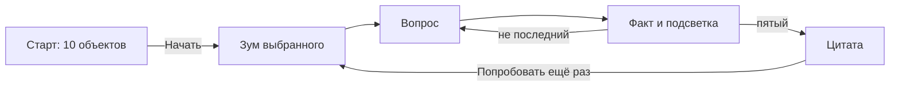

# Требования: викторина «Орбита России»

Источник правды для сборки киоска. Не менять вопросы, ответы, факты, цитаты, сценарий экранов и визуальные решения без явного запроса.

**Стенд:** Развитие человека — образование, наука и технологии. Международный фестиваль молодёжи, Екатеринбург. Горизонтальный тачскрин.

**Референсы оформления:** папка `Референсы/` в корне проекта.

## Правила набора

- **10 вариантов × 5 вопросов**, вопросы не повторяются между вариантами.
- В каждом сете **ровно 1 вопрос про космос или людей космоса**; остальные — география, природа, культура, наука, исследователи.
- Сложность: не «кто такой Гагарин» и не олимпиада. У каждого сета 1 чуть проще, 3 средних, 1 с изюминкой.
- История без войн, границ, репрессий, катастроф. Космос без гибели экипажей и гонки вооружений. Не спорим, кто «открыл Антарктиду». Не пишем, что у России больше всех часовых поясов в мире.
- Типы под горизонтальный тач: **4 кнопки**, **правда/неправда**, **сопоставить 4 пары**, **расставить по времени**, **лишнее**, **кто это**, **тап по карте**.
- Несколько вопросов про Урал и Екатеринбург.
- Язык: **сразу RU/EN**, переключатель на старте, дальше держим выбранный.

### Тексты на экране

- Варианты ответа **без подсказок в скобках**.
- Блок после ответа — **короткий факт для человека у экрана**, а не комментарий для постановщика. Тон энциклопедии: что это, зачем это помнят. Нельзя отсылать к стенду, фестивалю, «ловушкам для взрослых», «намёкам на войны», сравнениям «мы раньше — они позже».
- Названия сетов — «миссии». Космический вопрос не всегда последний.

### Выбор варианта на киоске

Авторизации нет, гостя система не знает. На **этом экране** хранится список уже показанных миссий (память приложения / localStorage). Новая игра берёт случайную миссию из ещё не показанных. Когда показаны все 10 — колода сбрасывается и перемешивается заново. Повторов нет, пока на аппарате не прокрутили полный круг — кем бы ни играли.

Цитаты на финальном экране — **отдельная колода из 10**: та же логика, без привязки к миссии.

---

## Сценарий экранов

Автовозврата с таймером нет: вход в викторину — только кнопка «Начать».

### 1. Старт

Горизонтальный кадр: тёмный зернистый космос (референс «Небесный объект» и стеклянные сферы «cosmos»), **10 вымышленных небесных тел**. Северное сияние на старте **не** используем — оно для финала.

Текст на экране (крупно, без канцелярита):

- RU: «Пять вопросов о географии, истории, науке и людях России. Займёт 2–4 минуты.»
- EN: «Five questions about Russia’s geography, history, science and people. It takes 2–4 minutes.»

Кнопки: **Начать / Start**, переключатель **RU | EN**.

Гость **не выбирает** объект пальцем. «Начать» берёт случайную миссию из колоды.

### 2. Переход в миссию

Остальные девять тел гаснут и уходят по орбитальным дугам. Выбранный объект выходит в центр и приближается (масштаб + лёгкий параллакс колец). Сверху мелкой подписью можно показать вымышленное имя объекта, не название миссии. Затем проявляется первый вопрос.

«Попробовать ещё раз» делает **то же самое**: новый случайный объект из оставшихся, та же анимация. Описание «2–4 минуты» второй раз не читаем.

### 3. Вопрос

Пять экранов подряд. Крупные зоны нажатия. Типы как в миссиях: 4 кнопки, правда/неправда, сопоставление (на таче — два касания, не drag), порядок, лишнее, кто это, тап по схеме карты.

После выбора:

- факт к **правильному** ответу всегда;
- выбранный вариант и верный **тихо подсвечиваются** (спокойное свечение у верного; если промахнулись — выбранный остаётся видимым, но тусклее);
- слов «верно», «ошибка», «правильно» нет, зелёного/красного светофора нет;
- кнопка **Далее / Next**.

Счётчик «вопрос 2 из 5» можно показать как тонкую орбитальную шкалу, без очков.

### 4. Финал — цитата, не оценка

**Не показываем**, сколько из пяти угадано. Ни баллов, ни «вы астронавт», ни прогресса знаний.

Фон — северное сияние (референс «Северное сияние в небе — текстура фона»). Поверх: один случайный текст из колоды цитат, имя, коротко кто это (писатель / учёный / космонавт). Кнопка **Попробовать ещё раз / Try again**.

---

## Десять небесных объектов

Каждый объект привязан к одной миссии. На старте все видны сразу. Стиль: стекло, внутреннее свечение, тонкие орбиты, зерно — как в референсах «cosmos» и «Небесный объект». Фон старта — тёмный космос без сияния.

1. **Кедра** — миссия «Поехали!»: янтарная сердцевина, одно тонкое кольцо
2. **Альта** — «Чайка»: серебристый диск, дуга как крыло
3. **Колыбель** — «Колыбель разума»: бледная мягкая сфера
4. **Селена** — «Лунная дорожка»: кратеры, кольцо-дорожка
5. **Эфир** — «Двенадцать минут»: разрыв в кольце (шлюз)
6. **Мира** — «Станция „Мир“»: несколько состыкованных стеклянных объёмов
7. **Пар** — «Звёздный экипаж»: два малых тела на общей орбите
8. **Оборот** — «Невидимое полушарие»: одна сторона в свете, другая в тени
9. **Поляр** — «Северное сияние»: сияние по лимбу
10. **Вуаль** — «Соседняя планета»: плотная облачная сфера

---

## Десять цитат

На экране — оригинал; для EN — аккуратный перевод, не подстрочник.

1. **Михаил Ломоносов**, учёный
  «Может собственных Платонов и быстрых разумом Невтонов российская земля рождать.»  
   *Ода 1747 года*
2. **Константин Циолковский**, учёный
  «Планета есть колыбель разума, но нельзя вечно жить в колыбели.»  
   *«Исследование мировых пространств реактивными приборами», 1911–1912*
3. **Юрий Гагарин**, космонавт
  «Облетев Землю в корабле-спутнике, я увидел, как прекрасна наша планета.»
4. **Дмитрий Менделеев**, учёный  
   «Стараясь познать бесконечное, наука сама конца не имеет.»  
   *предисловие к 8-му изданию «Основ химии», 1906*
5. **Александр Пушкин**, писатель  
   «Москва… как много в этом звуке / Для сердца русского слилось! / Как много в нём отозвалось!»  
   *«Евгений Онегин»*
6. **Николай Рерих**, художник  
   «Культура есть почитание Света. Культура есть любовь к человеку.»  
   *статья «Культура — почитание Света»*
7. **Иван Павлов**, учёный
  «Как ни совершенно крыло птицы, оно никогда не смогло бы поднять её ввысь, не опираясь на воздух. Факты — это воздух учёного.»  
   *«Письмо к молодёжи»*
8. **Владимир Вернадский**, учёный
  «Человек может и должен перестраивать своим трудом и мыслью область своей жизни. Перед ним открываются всё более широкие творческие возможности.»  
   *«Несколько слов о ноосфере»*
9. **Сергей Королёв**, конструктор  
   «Мы бы не двинулись вперёд, если бы не решались на смелые шаги в неизвестное.»
10. **Константин Паустовский**, писатель
  «Природа учит нас понимать прекрасное. Любовь к родной стране невозможна без любви к её природе.»

---

## Оформление

Референсы: папка `Референсы/` — на старте стеклянные сферы, орбиты и зернистый синий «Небесный объект»; северное сияние — **только фон финального экрана с цитатой**. Тонкий HUD по углам.

- Горизонтальный кадр, **резина под 16:9** (точный пиксельный размер экрана неизвестен). Минимум кнопок ~64 px по короткой стороне.
- Палитра: глубокий navy, циан, фиолетовое свечение, белая тонкая линия. Зерно поверх градиента.
- Вопрос — крупный текст по центру над карточками, прямо на фоне космоса. Лёгкий блюр медленно ходит по буквам туда-сюда. Ответы — почти прозрачные скруглённые плитки: заливки почти нет, по краям неравномерное циановое свечение, не обводка. Верный ответ подсвечивается целиком. Факт — внутри верной карточки.
- Шрифт: геометрический гротеск для заголовков, читаемый гротеск для длинного текста. Без декоративной «научной» каши из цифр в углу, которая мешает читать.
- Без эмодзи, без зелёно-красной школьной оценки.

---

## Принятые решения

- После ответа: факт + тихая подсветка, без «верно/неверно».
- Сразу RU/EN.
- «Попробовать ещё раз» = новый объект и зум, как «Начать».
- Вёрстка резиновая под горизонтальный 16:9.
- Итогового счёта нет.
- Автосброса по таймеру нет.

---

## Миссия 1. «Поехали!»

**1. Карта / 4 кнопки. География**
Граница Европы и Азии в районе Екатеринбурга проходит по…

- Кавказскому хребту
- **Уральским горам**
- реке Волге
- Среднерусской возвышенности

*Почему:* условную границу двух частей света здесь ведут по Уралу. У стелы «Европа — Азия» можно стоять одной ногой в Европе, другой — в Азии.

**2. 4 кнопки. История**
В каком году Пётр I основал Санкт-Петербург?

- 1147
- **1703**
- 1812
- 1917

*Почему:* город заложили в 1703 году на Заячьем острове, в устье Невы. 1147-й — год первого летописного упоминания Москвы.

**3. Кто это. Человек науки**
Помогал открыть университет в Москве, писал труды по русскому языку и создавал мозаики из цветного стекла. Кто это?

- Дмитрий Менделеев
- **Михаил Ломоносов**
- Николай Карамзин
- Иван Крузенштерн

*Почему:* Михаил Ломоносов — учёный-энциклопедист XVIII века. Московский университет открыли в 1755 году при его участии.

**4. 4 кнопки. Природа**
Какая река вытекает из Байкала?

- Селенга
- Лена
- **Ангара**
- Енисей

*Почему:* в Байкал впадают сотни рек, а вытекает одна — Ангара. Дальше она впадает в Енисей. Селенга, наоборот, несёт воду в озеро.

**5. 4 кнопки. Космос**
Какой позывной был у Юрия Гагарина в полёте 12 апреля 1961 года?

- Чайка
- Восток
- **Кедр**
- Алмаз

*Почему:* корабль назывался «Восток-1», позывной Гагарина — «Кедр». Он сделал один виток вокруг Земли. «Чайка» — позывной Валентины Терешковой.

---

## Миссия 2. «Чайка»

**1. 4 кнопки. География**
Куда впадает Волга — самая длинная река Европы?

- в Чёрное море
- в Балтийское море
- **в Каспийское море**
- в Белое море

*Почему:* Волга заканчивается в Каспии — крупнейшем замкнутом водоёме планеты. До Мирового океана её вода не доходит.

**2. Сопоставление. География городов**
Соедини город и устойчивое прозвище:

- Санкт-Петербург — **«северная Венеция»**
- Москва — **город на семи холмах**
- Екатеринбург — **город на границе Европы и Азии**
- Сочи — **«летняя столица» у тёплого моря**

*Почему:* у Петербурга — каналы и острова Невы, у Москвы — холмы, у Екатеринбурга — Уральский рубеж двух частей света, у Сочи — черноморское побережье.

**3. 4 кнопки. Культура**
Эрмитаж в Петербурге начинался как личная коллекция…

- Петра I
- **Екатерины II**
- Александра Пушкина
- Павла Третьякова

*Почему:* в 1764 году Екатерина II купила большое собрание картин — так начался будущий Эрмитаж. Павел Третьяков собирал другую коллекцию, в Москве.

**4. Лишнее. Природа**
Что здесь лишнее?

- Байкал
- Ладожское озеро
- Онежское озеро
- **Волга**

*Почему:* Байкал, Ладога и Онега — озёра. Волга — река.

**5. 4 кнопки. Космос**
Валентина Терешкова (позывной «Чайка») до сих пор единственная в мире женщина, которая…

- вышла в открытый космос
- **совершила космический полёт в одиночку**
- побывала на Луне
- командовала Международной космической станцией

*Почему:* 16–19 июня 1963 года она летела на «Востоке-6» одна. Все женщины после неё летали уже в экипажах. В открытый космос первой из женщин вышла Светлана Савицкая.

---

## Миссия 3. «Колыбель разума»

**1. 4 кнопки. География**
Сколько часовых поясов сейчас в России?

- 7
- 9
- **11**
- 24

*Почему:* поясов 11: от Калининграда до Камчатки. Когда в Москве утро, на Камчатке уже вечер.

**2. 4 кнопки. Наука**
Что необычного сделал Дмитрий Менделеев в таблице 1869 года?

- расположил элементы по алфавиту
- **оставил пустые клетки для ещё не открытых элементов**
- включил только металлы
- подписал таблицу как «вечную и неизменную»

*Почему:* пустые места он оставил сознательно и описал свойства будущих элементов. Позже там оказались галлий, скандий и германий.

**3. Правда / неправда. Природа**
«Байкал — самое большое озеро Земли по площади».

- Правда
- **Неправда**

*Почему:* по площади больше Каспий (его часто называют морем, но это озеро). Байкал — самое глубокое озеро планеты: 1642 метра. В нём около 20% озёрной пресной воды мира.

**4. Кто это. Человек науки**
Этот академик писал о живой оболочке планеты и о том, что разум человека становится геологической силой. Его слова — «биосфера» и «ноосфера».

- Иван Павлов
- **Владимир Вернадский**
- Константин Циолковский
- Василий Докучаев

*Почему:* Владимир Вернадский описал биосферу как оболочку Земли, которую создаёт жизнь. Ноосферой он называл следующий этап: когда мысль человека становится силой планетарного масштаба.

**5. 4 кнопки. Космос**
Константин Циолковский, живший в Калуге, назвал Землю «колыбелью разума». Чем он закончил эту мысль?

- «и лучше из неё не вылезать»
- **«но нельзя вечно жить в колыбели»**
- «поэтому космос человеку не нужен»
- «колыбель должна быть только на Луне»

*Почему:* калужский учитель вывел формулу ракеты и подробно описал, как человек может уйти за атмосферу. Рядом с его домом сейчас Музей космонавтики.

---

## Миссия 4. «Лунная дорожка»

**1. Карта / 4 кнопки. География**
Долина гейзеров — один из крупнейших гейзерных районов мира. Где она?

- на Байкале
- на Алтае
- **на Камчатке**
- в Карелии

*Почему:* на Камчатке десятки вулканов и горячих источников. Долину гейзеров в 1941 году описала гидрогеолог Татьяна Устинова.

**2. 4 кнопки. Инфраструктура**
Протяжённость Транссибирской магистрали от Москвы до Владивостока — около…

- 1800 км
- 4500 км
- **9300 км**
- 20 000 км

*Почему:* это самая длинная железная дорога на планете: около 9288 км. Строить её начали в 1891 году.

**3. Порядок. История**
Расставь события от раннего к позднему:

1. **Основание Санкт-Петербурга (1703)**
2. **Основание Екатеринбурга (1723)**
3. **Открытие Московского университета (1755)**
4. **Начало строительства Транссиба (1891)**

*Почему:* Екатеринбург основали в 1723 году как завод-крепость на Исети — через 20 лет после Петербурга.

**4. 4 кнопки. Человек / история**
Кто возглавил первое российское кругосветное плавание (1803–1806, корабли «Надежда» и «Нева»)?

- Витус Беринг
- **Иван Крузенштерн**
- Семён Дежнёв
- Николай Пржевальский

*Почему:* Иван Крузенштерн и Юрий Лисянский обошли земной шар и уточнили карту Тихого океана. Беринг ходил от Камчатки к Америке, но кругосветного плавания не совершал.

**5. 4 кнопки. Космос**
В 1970 году на Луну доставили «Луноход-1». Что в этом было впервые в мире?

- первый человек на Луне
- **первый дистанционный планетоход на другом небесном теле**
- первая фотография обратной стороны Луны
- первая доставка лунного грунта на Землю

*Почему:* «Луноход-1» сел в Море Дождей 17 ноября 1970 года и ехал по командам с Земли. Снимки обратной стороны Луны сделала «Луна-3» в 1959 году. Лунный грунт на Землю раньше привезла станция «Луна-16».

---

## Миссия 5. «Двенадцать минут»

**1. 4 кнопки. География**
Какая вершина — высочайшая в России?

- Народная (Урал)
- Белуха (Алтай)
- Ключевская Сопка (Камчатка)
- **Эльбрус (Кавказ)**

*Почему:* высота Эльбруса — около 5642 метров, это потухший вулкан. Народная — высшая точка Урала, Ключевская Сопка — один из высочайших действующих вулканов Евразии, но ниже Эльбруса.

**2. Правда / неправда. Наука и техника**
«Большие фонтаны Петергофа задумал Пётр I так, чтобы они били за счёт перепада высот, без насосов».

- **Правда**
- Неправда

*Почему:* вода к Большому каскаду идёт из верхних прудов самотёком. Насосной станции для этого не требовалось. Систему заложили при Петре I.

**3. 4 кнопки. Человек / история**
Русский путешественник XIX века жил среди папуасов Новой Гвинеи и доказывал, что все народы равны. Кто это?

- Николай Пржевальский
- **Николай Миклухо-Маклай**
- Иван Крузенштерн
- Пётр Семёнов-Тян-Шанский

*Почему:* Николай Миклухо-Маклай подолгу жил на берегу Новой Гвинеи, вёл дневники и отстаивал, что человечество едино по природе.

**4. Лишнее. География**
Какой город не стоит на Волге?

- Казань
- Нижний Новгород
- **Новосибирск**
- Волгоград

*Почему:* Новосибирск стоит на Оби. Казань, Нижний Новгород и Волгоград — на Волге.

**5. Правда / неправда. Космос**
«Алексей Леонов в 1965 году первым вышел в открытый космос — и едва вернулся внутрь, потому что скафандр раздулся».

- **Правда**
- Неправда

*Почему:* в вакууме костюм вспух, и Леонов стравил давление, чтобы пролезть в шлюз. Выход длился около 12 минут. Он же первым рисовал в космосе.

---

## Миссия 6. «Станция „Мир“»

**1. Карта / 4 кнопки. География**
Самая северная материковая точка Евразии — мыс…

- Дежнёва
- **Челюскин**
- Желания
- Флигели

*Почему:* мыс Челюскин находится на полуострове Таймыр. Мыс Дежнёва — крайняя восточная точка материка. Мыс Флигели и мыс Желания — на островах, не на материке.

**2. 4 кнопки. История открытий**
Шлюпы «Восток» и «Мирный» в экспедиции 1819–1821 годов вели Беллинсгаузен и Лазарев. Куда они ходили?

- к Северному полюсу
- **к южным полярным льдам, к берегам Антарктиды**
- вокруг Африки в Индию
- только вдоль Камчатки

*Почему:* в 1819–1821 годах шлюпы прошли вдоль антарктических льдов и описали берега Южного материка. Имена «Восток» и «Мирный» позже повторились в названиях космических кораблей и орбитальной станции.

**3. 4 кнопки. Человек науки**
Иван Павлов всемирно известен опытами с собаками. Что он в них изучал?

- строение клетки
- **условные рефлексы**
- состав почвы
- движение планет

*Почему:* если кормить собаку после звонка, со временем слюна появляется уже на один звонок. Так Павлов показывал, как организм учится реагировать на сигнал. Нобелевскую премию 1904 года он получил за работы по пищеварению.

**4. 4 кнопки. Природа**
Чем Байкал особенно поражает по сравнению с пятью Великими озёрами Северной Америки?

- он теплее
- **в нём больше пресной воды, чем во всех пяти вместе**
- он моложе их на миллион лет
- в нём нет жизни

*Почему:* объём байкальской воды — около 23,6 тысячи кубических километров. Озеру десятки миллионов лет; здесь живёт, например, байкальская нерпа.

**5. 4 кнопки. Космос**
Врач-космонавт Валерий Поляков на станции «Мир» провёл один полёт длиной около…

- 2 недель
- 3 месяцев
- **14,5 месяцев (437 суток)**
- 5 лет

*Почему:* это до сих пор рекорд самого длинного непрерывного полёта. Станция «Мир» работала на орбите с 1986 по 2001 год.

---

## Миссия 7. «Звёздный экипаж»

**1. 4 кнопки. География**
Крупнейшее пресное озеро Европы — это…

- Байкал
- **Ладожское**
- Каспийское море
- Озеро Ильмень

*Почему:* Байкал глубже и многоводнее, но лежит в Азии. Каспий больше всех озёр по площади, однако вода в нём солёная. Среди пресных озёр Европы первое — Ладога.

**2. Сопоставление. Культура**
Соедини произведение и автора:

- «Евгений Онегин» — **Александр Пушкин**
- «Анна Каренина» — **Лев Толстой**
- «Вишнёвый сад» — **Антон Чехов**
- «Щелкунчик» — **Пётр Чайковский**

*Почему:* «Евгений Онегин» — роман в стихах, «Щелкунчик» — балет 1892 года. Чайковский родился в Воткинске.

**3. Правда / неправда. История города**
«Екатеринбург назван в честь Екатерины II Великой».

- Правда
- **Неправда**

*Почему:* город основали в 1723 году и назвали в честь Екатерины I, жены Петра I. Екатерина II взошла на престол в 1762 году.

**4. 4 кнопки. Человек / история**
Кто раньше прошёл проливом между Азией и Америкой?

- Витус Беринг в XVIII веке
- **Семён Дежнёв в 1648 году**
- Иван Крузенштерн в XIX веке
- Джеймс Кук в XVIII веке

*Почему:* Семён Дежнёв обогнул Чукотку в 1648 году — за 80 лет до плавания Беринга. Позднее пролив назвали Беринговым.

**5. 4 кнопки. Космос**
Белка и Стрелка известны тем, что они…

- первыми живыми существами оказались в космосе
- **первыми животными, которые вернулись на Землю из орбитального полёта**
- побывали на Луне
- летали вместе с Гагариным

*Почему:* в августе 1960 года они облетели Землю на корабле «Спутник-5» и вернулись живыми. Щенок Стрелки по кличке Пушинка потом жил в семье президента Кеннеди.

---

## Миссия 8. «Невидимое полушарие»

**1. Сопоставление. География**
Соедини реку и море, в которое она в итоге несёт воду:

- Обь — **Карское море**
- Лена — **море Лаптевых**
- Амур — **Охотское море**
- Нева — **Балтийское море**

*Почему:* Обь впадает в Обскую губу Карского моря, Лена — в море Лаптевых, Амур — в Амурский лиман Охотского моря, Нева — в Балтику у Санкт-Петербурга.

**2. 4 кнопки. Культура / география**
На каком озере стоит остров Кижи?

- Байкал
- **Онежское**
- Балатон
- Телецкое

*Почему:* Кижи — остров на Онежском озере в Карелии. Там стоит Преображенская церковь XVIII века, собранная из сосны.

**3. Кто это. Человек науки**
Москвичка XIX века стала профессором математики в Стокгольме — одной из первых женщин-профессоров математики в Европе. Кто она?

- Валентина Терешкова
- **Софья Ковалевская**
- Екатерина Дашкова
- Анна Ахматова

*Почему:* Софья Ковалевская занималась уравнениями в частных производных и вращением твёрдого тела. Екатерина Дашкова возглавляла Академию наук, но математиком не была.

**4. 4 кнопки. Природа**
Принятая оценка возраста озера Байкал — около…

- 10 тысяч лет
- 1 миллиона лет
- **25 миллионов лет**
- 500 миллионов лет

*Почему:* большинство озёр мелеет и зарастает за тысячи лет. Байкал лежит в рифтовой впадине: ему десятки миллионов лет, и котловина до сих пор медленно расширяется.

**5. 4 кнопки. Космос**
Какой аппарат в 1959 году впервые сфотографировал обратную сторону Луны?

- «Спутник-1»
- **«Луна-3»**
- «Луноход-1»
- «Восток-1»

*Почему:* с Земли обратная сторона Луны не видна: спутник всегда повёрнут к нам одним и тем же полушарием. В 1959 году «Луна-3» обошла её и передала первые снимки.

---

## Миссия 9. «Северное сияние»

**1. 4 кнопки. Природа**
На каком острове России дольше всего жили последние шерстистые мамонты?

- Сахалин
- Валаам
- **Врангеля**
- Кижи

*Почему:* на острове Врангеля мамонты жили ещё около четырёх тысяч лет назад — в то время, когда в Египте уже стояли пирамиды. Сейчас это заповедник и объект ЮНЕСКО.

**2. 4 кнопки. География**
Белые ночи в Санкт-Петербурге бывают потому, что город…

- стоит у тёплого течения
- **находится на высокой широте: летом Солнце почти не заходит**
- окружён зеркалами каналов
- ближе к Северному полюсу, чем Мурманск

*Почему:* Петербург лежит примерно на 60-й параллели. Летом Солнце опускается за горизонт неглубоко, и ночь остаётся светлой. Мурманск севернее: там бывает полярный день.

**3. Порядок. Наука**
От раннего к позднему:

1. **Московский университет (1755)**
2. **Геометрия Лобачевского (~1829, Казань)**
3. **Таблица Менделеева (1869)**
4. **Нобелевская премия Ивана Павлова (1904)**

*Почему:* университет открыли в 1755 году, работу Лобачевского опубликовали в Казани в 1829-м, таблицу Менделеев составил в 1869-м, Павлов получил Нобелевскую премию в 1904-м.

**4. 4 кнопки. Культура**
Павел Третьяков собрал и передал Москве коллекцию, ставшую Третьяковской галереей. Что в ней было главным?

- античные статуи
- **русская живопись**
- карты звёздного неба
- императорские короны

*Почему:* более сорока лет Третьяков покупал картины русских художников и в 1892 году передал собрание Москве. Так появилась Третьяковская галерея.

**5. 4 кнопки. Космос**
Кто первым из женщин вышел в открытый космос?

- Валентина Терешкова
- **Светлана Савицкая**
- Салли Райд
- Елена Кондакова

*Почему:* Терешкова в 1963 году летела одна и из корабля не выходила. Светлана Савицкая вышла в открытый космос 25 июля 1984 года со станции «Салют-7».

---

## Миссия 10. «Соседняя планета»

**1. 4 кнопки. Природа**
Дикий амурский тигр в России в основном живёт в лесах…

- Кавказа
- **Сихотэ-Алиня**
- Кольского полуострова
- Подмосковья

*Почему:* хребет Сихотэ-Алинь в Приморском крае — основная территория дикого амурского тигра в России. Там же живёт дальневосточный леопард.

**2. Кто это. Человек науки**
В XIX веке ректор Казанского университета описал геометрию, в которой через точку вне прямой можно провести несколько прямых, параллельных данной. Кто это?

- Евклид
- **Николай Лобачевский**
- Дмитрий Менделеев
- Сергей Королёв

*Почему:* Лобачевский изложил эту систему в 1829 году. Её называют геометрией Лобачевского, или неевклидовой геометрией. Позже ею пользовались физики.

**3. Сопоставление. География**
Соедини место и регион:

- Долина гейзеров — **Камчатка**
- Ленские столбы — **Якутия**
- Эльбрус — **Кавказ**
- Малахит в сказах Бажова — **Урал**

*Почему:* долина гейзеров — на Камчатке, Ленские столбы — на реке Лене в Якутии, Эльбрус — на Кавказе. Малахит, о котором писал Бажов, добывали на Урале.

**4. Лишнее. Урал**
Что здесь не про Урал?

- малахит
- сказы Бажова
- Невьянская башня
- **хохлома**

*Почему:* хохломской росписью издавна занимались в заволжских сёлах, это Нижегородская область. Малахит, сказы Бажова и Невьянская башня — уральские.

**5. 4 кнопки. Космос**
Аппарат «Венера-7» в 1970 году впервые в мире…

- высадил человека на Венеру
- **передал данные с поверхности другой планеты**
- привёз грунт с Марса
- сфотографировал обратную сторону Луны

*Почему:* у поверхности Венеры давление в десятки раз выше земного, температура — около 460 °C. Станция успела передать сигнал с грунта. Обратную сторону Луны сняла «Луна-3».

---

## Стек и порядок сборки

Веб-приложение в корне проекта: **Vite + React**. Полноэкранный Chrome в режиме киоска. Данные миссий и цитат — в отдельных файлах. Все строки интерфейса, вопросов, фактов и цитат — через словарь **RU/EN**. Объекты на старте — CSS/SVG, не тяжёлый 3D. Анимации — CSS и лёгкий motion.

Порядок: стартовый экран (10 объектов, текст, RU/EN, «Начать», зум) → вопросы → финал с цитатой.
